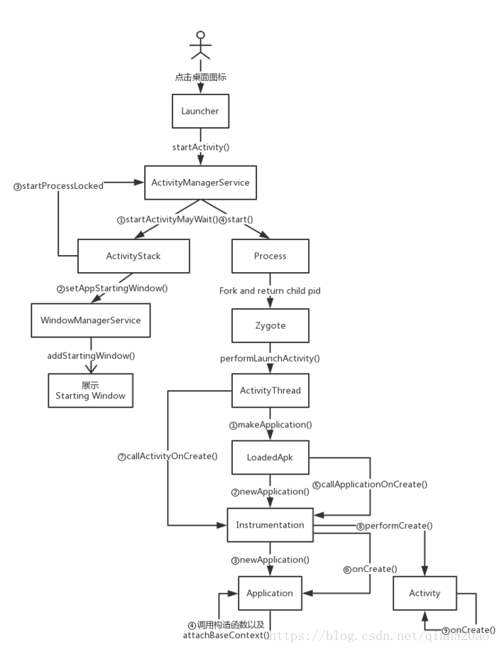
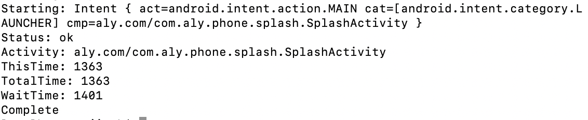
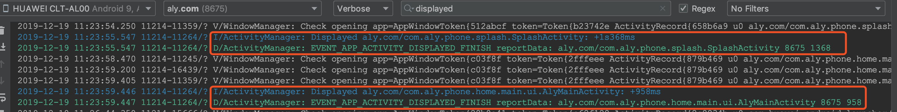
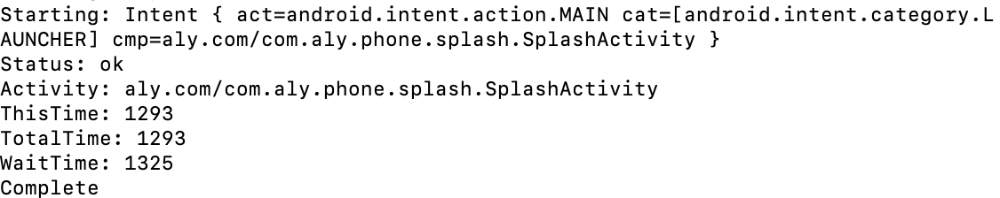

## App优化

1. app 启动优化（视觉体验优化）

   * 白屏、黑屏问题？(不会缩短实际冷启动时间)

   ```xml
   <application
       android:name=".base.App"
       ...
       android:theme="@style/AppThemeBase"
       >
   ```

   styles.xml 增加一个主题叫AppThemeBase

   ```xml
   <style name="AppThemeBase" parent="XUITheme.Phone">
      ...
       <!--  设置启动白屏的图片背景 -->
       <item name="android:windowBackground">@drawable/theme_bg</item>
   </style>
   ```

   <!--more-->

   这样的话启动Activity之后背景会一直在，所以在Activity的onCreate方法中切换成正常主题

   ```kotlin
   override fun onCreate(savedInstanceState: Bundle?) {
       setTheme(R.style.AppTheme)
       super.onCreate(savedInstanceState)
       ...
   }
   
   ```

   * 设置透明主题

   ```xml
   <style name="AppTheme" parent="Theme.AppCompat.Light.DarkActionBar">
       <item name="android:windowFullscreen">true</item>
       <item name="android:windowIsTranslucent">true</item>
   </style>
   ```

   虽然可以解决黑白屏问题，但是从点击app图标，到APP启动首界面会出现短暂的视觉停留效果。

2. 查看app启动时长

   

   * **通过命令** `adb shell am start -S -W 包名/启动类的全限定名` ， -S **表示重启当前应用**

     

   ThisTime : 最后一个 Activity 的启动耗时

   TotalTime : 启动一连串的 Activity 总耗时

   WaitTime : 应用进程的创建过程 + TotalTime 

   * **系统日志统计**

   另外也可以根据系统日志来统计启动耗时，在Android Studio中查找已用时间，必须在logcat视图中禁用过滤器(No Filters)。因为这个是系统的日志输出，而不是应用程序的。你也可以查看其它应用程序的启动耗时。

   过滤`displayed`输出的启动日志.

   

3. Application中可能存在的一些耗时操作

   * 第三方库的初始化操作
   * IO操作

   解决方式：

   * 子线程初始化

   

   可以看出通过子线程优化 由原来的1363 减少至 1293

   * 需要在主线程中初始化，但不立即使用的库，进行延迟初始化操作

4. 冷启动的过程中系统会初始化应用程序进程，创建Application等任务，这时候会展示一个 **启动窗口** Starting Window，上面分析了过，如果没有优化主题的话，那么就是白屏。

5. 闪屏页优化

   Application 初始化后会调用 attachBaseContext() 方法，再调用 Application 的 onCreate()，再到入口 Activity的创建和执行 onCreate() 方法。所以我们就可以在 Application 中记录启动时间。

   //Application

   ```java
   @Override
   protected void attachBaseContext(Context base) {
       super.attachBaseContext(base);
   	SPUtil.putLong("application_attach_time", System.currentTimeMillis());//记录Application初始化时间
   }
   
   ```

   有了启动时间，我们得知道入口的 Acitivty 显示给用户的时间,View绘制完毕在onWindowFocusChanged()的回调时机中表示可以获取用户的触摸时间和View的流程绘制完毕，所以我们可以在这个方法里记录显示时间。

   //入口Activity

   ```
   @Override
   public void onWindowFocusChanged(boolean hasFocus) {
       super.onWindowFocusChanged(hasFocus);
     
         long appAttachTime = SPUtil.getLong("application_attach_time");
         long diffTime = System.currentTimeMillis() - appAttachTime;//从application到入口Acitity的时间
    
   	 //所以闪屏页展示的时间为 2000ms - diffTime.
   }
   ```

   所以我们就可以动态的设置应用闪屏的显示时间，尽量让每一部手机展示的时间一致，这样就不会让手机配置较低的用户感觉漫长难熬的闪屏页时间（例如初始化了2000ms，又要展示2000ms的闪屏页时间.），优化用户体验。

6. 以动态的设置应用闪屏的显示时间，尽量让每一部手机展示的时间一致，这样就不会让手机配置较低的用户感觉漫长难熬的闪屏页时间（例如初始化了2000ms，又要展示2000ms的闪屏页时间.），优化用户体验。


## 内存优化

1. 内存问题之所以会影响到界面流畅度，是因为垃圾回收（GC，Garbage Collection），在 GC 时，所有线程都要停止，包括主线程，当 GC 和绘制界面的操作同时触发时，绘制的执行就会被搁置，导致掉帧，也就是界面卡顿。
2. 